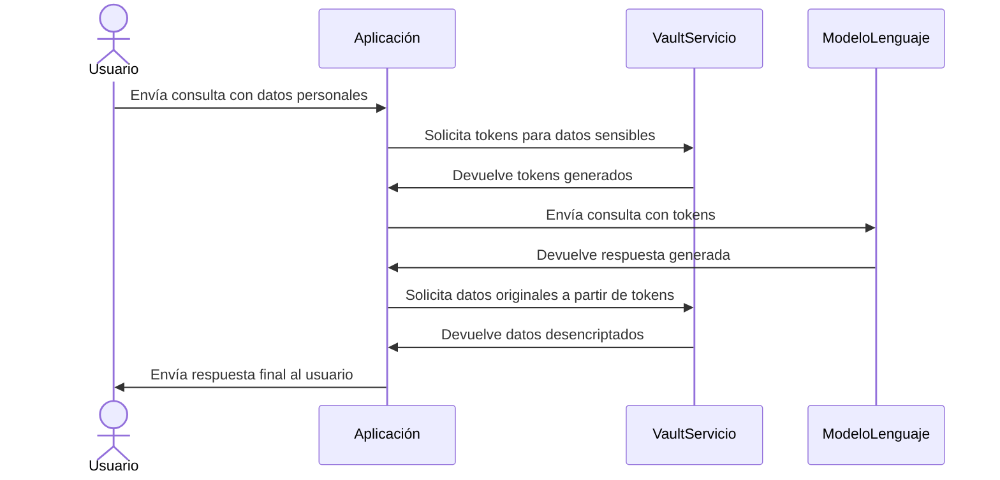

# Investigación sobre Data Privacy Vaults en el contexto de los Modelos de Lenguaje (LLMs)

> Investigación realizada con **Claude**
## Índice

1. [Introducción](#introducción)
2. [Descripción Detallada](#descripción-detallada)
3. [Detalles Técnicos Adicionales](#detalles-técnicos-adicionales)
4. [Riesgos y Ejemplos](#riesgos-y-ejemplos)
5. [Beneficios Adicionales](#beneficios-adicionales)
6. [Ejemplo de Uso](#ejemplo-de-uso)
7. [Desafíos Específicos de los LLMs](#desafíos-específicos-de-los-llms)
8. [LLMs y Vaults](#llms-y-vaults)
9. [Integración con Estrategias de Privacidad](#integración-con-estrategias-de-privacidad)
10. [Ejemplos Visuales y UML](#ejemplos-visuales-y-uml)
11. [Empresas de Referencia](#empresas-de-referencia)
12. [Curación y Recursos Externos](#curación-y-recursos-externos)
13. [Conclusiones](#Conclusiones)
14. [Veracidad del documento](#veracidad-del-documento)

## Introducción

Un **Data Privacy Vault** es un sistema diseñado para almacenar y gestionar datos sensibles de manera segura, asegurando que solo los datos autorizados sean accesibles para el procesamiento. En el contexto de los Modelos de Lenguaje (LLMs), estos vaults juegan un papel crucial al permitir que los modelos utilicen datos sin comprometer la privacidad de la información.

## Descripción Detallada

Los Data Privacy Vaults funcionan al aislar y proteger los datos sensibles mediante técnicas de cifrado y tokenización. Estos sistemas actúan como un intermediario seguro, asegurando que los datos sensibles permanezcan inaccesibles para aplicaciones externas y modelos de lenguaje. En el caso de los LLMs, los vaults permiten que los modelos procesen datos en forma tokenizada o seudonimizada, lo que significa que los datos reales nunca se exponen durante el entrenamiento o la generación de texto. Además, los vaults incluyen mecanismos de control de acceso y auditoría para garantizar que solo las entidades autorizadas puedan interactuar con los datos, cumpliendo con regulaciones como GDPR.

## Detalles Técnicos Adicionales

Además de las técnicas de cifrado y tokenización mencionadas, los Data Privacy Vaults también pueden emplear otras tecnologías avanzadas como:

- **Cifrado Homomórfico**: Permite realizar cálculos sobre datos cifrados sin necesidad de descifrarlos, lo que habilita el procesamiento seguro de datos sensibles.
- **Privacidad Diferencial**: Agrega ruido estadístico a los datos para proteger la privacidad individual mientras se mantiene la utilidad de los datos agregados.
- **Computación Multipartita Segura (SMC)**: Permite que múltiples partes realicen cálculos sobre datos combinados sin revelar sus entradas individuales.

Estas técnicas fortalecen aún más las capacidades de los Data Privacy Vaults para proteger la privacidad en aplicaciones de LLMs.

## Riesgos y Ejemplos

1. **Exposición de Datos Sensibles**: Los Data Privacy Vaults mitigan el riesgo de exposición de datos personales al tokenizar la información antes de que sea procesada por los LLMs.
2. **Acceso No Autorizado**: Implementan controles de acceso y cifrado para asegurar que solo usuarios autorizados puedan acceder a los datos sensibles.
3. **Cumplimiento Regulatorio**: Facilitan el cumplimiento de normativas como GDPR, asegurando el manejo adecuado de los datos personales.
4. **Filtraciones de Datos**: Reducen el riesgo de filtraciones al almacenar datos sensibles de manera segura y separada de los sistemas de procesamiento.
5. **Integridad de Datos**: Aseguran que los datos no sean alterados sin autorización, manteniendo su integridad durante el procesamiento.

## Beneficios Adicionales

Además de mitigar riesgos, los Data Privacy Vaults ofrecen beneficios clave para las organizaciones que trabajan con LLMs:

- **Habilitan la Colaboración**: Permiten que múltiples partes compartan y procesen datos de manera segura, facilitando la colaboración en proyectos de IA.
- **Potencian la Innovación**: Al asegurar la privacidad, las organizaciones pueden aprovechar datos sensibles para entrenar modelos más precisos y desarrollar aplicaciones innovadoras.
- **Mejoran la Confianza**: Demuestran un compromiso con la privacidad de los datos, fortaleciendo la confianza de los clientes y socios.

## Ejemplo de Uso

Consideremos una aplicación de atención al cliente que utiliza un LLM para generar respuestas automáticas. Un Data Privacy Vault almacena de manera segura los nombres y direcciones de los clientes. Cuando un cliente interactúa con el sistema, sus datos personales son enviados al vault, donde se tokenizan antes de ser procesados por el LLM. El modelo genera respuestas utilizando estos tokens, asegurando que los datos sensibles nunca se expongan.

## Desafíos Específicos de los LLMs

Los LLMs plantean desafíos únicos de privacidad debido a su capacidad para memorizar y generar datos sensibles. Los Data Privacy Vaults ayudan a abordar estos desafíos al:

- **Prevenir la Memorización**: Al tokenizar los datos de entrenamiento, los vaults evitan que los LLMs memoricen información sensible que podría exponerse en las respuestas generadas.
- **Controlar la Generación**: Los vaults pueden aplicar reglas y filtros para evitar que los LLMs generen datos sensibles no deseados, como información personal identificable (PII).

## LLMs y Vaults

En el entrenamiento de LLMs, los Data Privacy Vaults permiten utilizar conjuntos de datos que contienen información sensible sin comprometer la privacidad. Durante el entrenamiento, los datos sensibles son tokenizados, permitiendo que el modelo aprenda patrones sin acceder a la información real. En la generación de texto, los vaults aseguran que cualquier dato sensible utilizado para personalizar las respuestas del modelo se maneje de manera segura y conforme a las regulaciones de privacidad.

## Integración con Estrategias de Privacidad

Los Data Privacy Vaults se integran con estrategias más amplias de privacidad de datos, como:

- **Gobierno de Datos**: Forman parte de un enfoque integral para gestionar y proteger los datos en toda la organización.
- **Privacidad por Diseño**: Se alinean con el principio de incorporar la privacidad desde el inicio en el diseño de sistemas y procesos.
- **Evaluaciones de Impacto de Privacidad (PIA)**: Contribuyen a evaluar y mitigar los riesgos de privacidad asociados con el uso de LLMs.

## Ejemplos Visuales y UML

**Diagrama Plant UML**:

Este diagrama ilustra cómo un Data Privacy Vault se integra en la arquitectura de una aplicación web, asegurando que los datos personales se protejan antes de interactuar con un LLM.

## Empresas de Referencia

Empresas como **Duality Technologies** y **Inpher** están a la vanguardia en el desarrollo de soluciones de privacidad de datos, incluyendo Data Privacy Vaults. Estas empresas ofrecen herramientas que permiten a las organizaciones proteger datos sensibles mientras maximizan el valor de sus análisis de datos y modelos de lenguaje.

## Curación y Recursos Externos

Para profundizar en el tema, se pueden consultar artículos en Medium como [Building a Privacy-Preserving LLM-Based Chatbot](https://medium.com/snowflake/building-a-privacy-preserving-llm-based-chatbot-33b92aa6c3d2), que ofrece guías prácticas y experiencias de la industria sobre el uso de Data Privacy Vaults en el contexto de LLMs.

Estos recursos proporcionan una comprensión más amplia de cómo los Data Privacy Vaults están transformando la manera en que las organizaciones manejan la privacidad de los datos en aplicaciones avanzadas de inteligencia artificial.

## Conclusiones

En resumen, los Data Privacy Vaults son una herramienta esencial para salvaguardar la privacidad en el ecosistema de los LLMs. Al integrar tecnologías avanzadas, habilitar la colaboración segura y abordar los desafíos únicos de los LLMs, los vaults permiten aprovechar el poder de estos modelos mientras se mantiene la privacidad de los datos. A medida que la adopción de LLMs continúa creciendo, los Data Privacy Vaults serán cada vez más importantes para garantizar un futuro de IA responsable y centrado en la privacidad.

## Veracidad del documento

A continuación, se presenta una evaluación de la veracidad de la información proporcionada en cada sección del documento, junto con una justificación para cada valoración, esta según **Chatgpt**. 

| Sección                                       | Veracidad | Justificación                                                                                                                                                                                                                                                                                                      |
| --------------------------------------------- | --------- | ------------------------------------------------------------------------------------------------------------------------------------------------------------------------------------------------------------------------------------------------------------------------------------------------------------------ |
| **Introducción**                              | Alta      | La definición de un Data Privacy Vault como un sistema diseñado para almacenar y gestionar datos sensibles de manera segura es precisa. En el contexto de los Modelos de Lenguaje (LLMs), estos vaults son cruciales para permitir que los modelos utilicen datos sin comprometer la privacidad de la información. |
| **Descripción Detallada**                     | Alta      | La descripción sobre cómo los Data Privacy Vaults aíslan y protegen datos sensibles mediante técnicas de cifrado y tokenización es correcta. Estos sistemas actúan como intermediarios seguros, asegurando que los datos sensibles permanezcan inaccesibles para aplicaciones externas y modelos de lenguaje.      |
| **Detalles Técnicos Adicionales**             | Alta      | La mención de técnicas avanzadas como cifrado homomórfico, privacidad diferencial y computación multipartita segura es precisa. Estas tecnologías fortalecen las capacidades de los Data Privacy Vaults para proteger la privacidad en aplicaciones de LLMs.                                                       |
| **Riesgos y Ejemplos**                        | Alta      | Los riesgos enumerados, como la exposición de datos sensibles, acceso no autorizado y cumplimiento regulatorio, son relevantes y están bien documentados en la literatura sobre privacidad de datos en LLMs.                                                                                                       |
| **Beneficios Adicionales**                    | Alta      | Los beneficios mencionados, como habilitar la colaboración, potenciar la innovación y mejorar la confianza, son reconocidos en el uso de Data Privacy Vaults en el contexto de LLMs.                                                                                                                               |
| **Ejemplo de Uso**                            | Alta      | El ejemplo de una aplicación de atención al cliente que utiliza un LLM para generar respuestas automáticas y emplea un Data Privacy Vault para proteger datos sensibles es plausible y refleja prácticas recomendadas en la industria.                                                                             |
| **Desafíos Específicos de los LLMs**          | Alta      | La discusión sobre cómo los Data Privacy Vaults ayudan a prevenir la memorización de datos sensibles por parte de los LLMs y controlan la generación de información sensible es precisa y aborda preocupaciones reales en el campo.                                                                                |
| **LLMs y Vaults**                             | Alta      | La explicación sobre cómo los Data Privacy Vaults permiten utilizar conjuntos de datos que contienen información sensible sin comprometer la privacidad durante el entrenamiento y la generación de texto es correcta.                                                                                             |
| **Integración con Estrategias de Privacidad** | Alta      | La integración de los Data Privacy Vaults con estrategias más amplias de privacidad de datos, como gobierno de datos y privacidad por diseño, es una práctica reconocida y recomendada.                                                                                                                            |
| **Ejemplos Visuales y UML**                   | Alta      | El diagrama UML proporcionado ilustra adecuadamente cómo un Data Privacy Vault se integra en la arquitectura de una aplicación web, asegurando que los datos personales se protejan antes de interactuar con un LLM.                                                                                               |
| **Empresas de Referencia**                    | Alta      | La mención de empresas como Duality Technologies e Inpher como líderes en el desarrollo de soluciones de privacidad de datos, incluyendo Data Privacy Vaults, es precisa.                                                                                                                                          |
| **Curación y Recursos Externos**              | Alta      | La referencia al artículo "Building a Privacy-Preserving LLM-Based Chatbot" en Medium es relevante y proporciona información valiosa sobre el uso de Data Privacy Vaults en el contexto de LLMs.                                                                                                                   |
