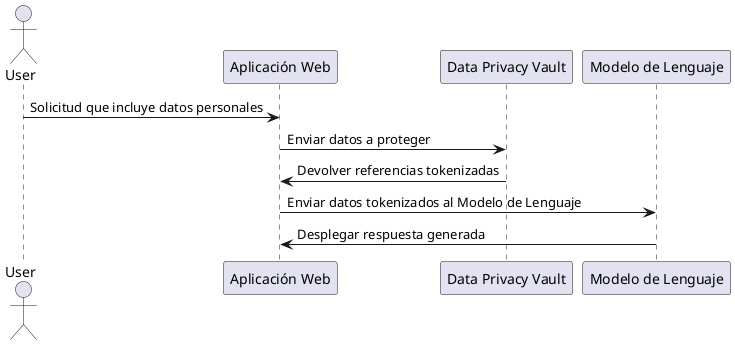

### Leandro Alberto Garcia Silva
```markdown
Como un experto en ciberseguridad, investiga sobre "Data Privacy Vaults" en el contexto de los Modelos de Lenguaje (LLMs), profundizando en sus casos de uso y cómo benefician la privacidad de datos.

Explora cómo los "Data Privacy Vaults" se utilizan específicamente en el contexto de grandes modelos de lenguaje (LLMs). Explica cómo funcionan estos mecanismos para proteger información sensible y cómo contribuyen a mantener una comunicación y generación de texto seguras y privadas. La explicación debe ser completa e incluir:

- Una descripción breve de qué es un Data Privacy Vault.
- Una descripción detallada que aborde aspectos técnicos de cómo opera.
- Un listado de 5 riesgos que resuelven los Data Privacy Vaults, incluyendo su aplicación en el entrenamiento de LLMs.
- Un ejemplo de uso que ilustre cómo se emplearía al proteger datos sensibles en un contexto práctico de grandes modelos de lenguaje.
- Un diagrama de flujo utilizando Plant UML que muestre cómo podría integrarse un Data Privacy Vault con la arquitectura de una aplicación web.

Además, ten en cuenta los siguientes puntos para una mayor comprensión:

- Proporciona ejemplos claros y detallados sobre cómo se integran los Data Privacy Vaults con LLMs, tanto en el entrenamiento de modelos como en el uso de generación de texto.
- Identifica y menciona empresas y herramientas que actualmente están desarrollando o utilizando Data Privacy Vaults, incluyendo iniciativas clave en el campo.
- Añade ejemplos tanto textuales como visuales para ilustrar los conceptos de forma clara y atractiva.
- Cura contenidos relevantes a partir de fuentes confiables y actualizadas, ofreciendo diversos ángulos y contextos sobre el tema.
- Proporciona las referencias de las fuentes utilizadas, incluyendo artículos de sitios como Medium (https://medium.com/) que ofrezcan guías de implementación práctica y experiencias de la industria.

# Steps

1. **Definición Breve**: Describe en una frase qué es un "Data Privacy Vault".
2. **Descripción Detallada**: Explica en detalle cómo operan los Data Privacy Vaults, abordando conceptos técnicos y cómo aseguran la privacidad.
3. **Riesgos Mitigados**: Lista cinco riesgos principales que se resuelven con el uso de Data Privacy Vaults al trabajar con LLMs.
4. **Ejemplo de Uso**: Presenta un caso concreto donde se muestre cómo se aplicaría un Data Privacy Vault en la protección de datos sensibles.
5. **Diagrama UML**: Genera un diagrama de flujo usando Plant UML para ilustrar cómo se integraría un Data Privacy Vault en la arquitectura de una aplicación web.
6. **LLMs y Vaults**: Describe cómo se usan los Data Privacy Vaults específicamente con LLMs. Explica su ajuste en el proceso de entrenamiento y generación.
7. **Ejemplos Textuales y Visuales**: Proporciona ejemplos ilustrativos para resaltar puntos importantes.
8. **Empresas y Herramientas**: Menciona nombres específicos de empresas y herramientas que utilicen estas tecnologías, destacando su importancia.
9. **Curación de Contenidos**: Incluye enlaces relevantes a blogs y artículos informativos sobre Data Privacy Vaults. Estos deben ser de fuentes confiables actuales.

# Output Format

La salida debe estar en formato de párrafos bien estructurados, incluyendo:

- **Introducción**: Un párrafo introductorio breve que defina qué es un Data Privacy Vault y su papel en el contexto actual de los modelos de lenguaje.
- **Descripción Detallada**: Explicación completa de cómo operan los Data Privacy Vaults y su utilidad específica con LLMs.
- **Riesgos y Ejemplos**: Un listado de 5 riesgos y cómo el uso de Data Privacy Vaults abordan estos problemas.
- **Ejemplos Visuales y UML**: Describe un ejemplo detallado de integración utilizando diagramas UML con Plant UML, e incluye ejemplos visuales cuando sea adecuado.
- **Empresas de Referencia**: Menciona las empresas y herramientas destacadas mediante oraciones bien articuladas.
- **Curación y Recursos Externos**: Presenta recursos adicionales con enlaces a sitios como Medium y artículos relevantes para profundizar.

# Examples

**Ejemplo de Integración Textual**:  
"Un Data Privacy Vault se utiliza para almacenar los identificadores personales de los usuarios de manera segura mientras el LLM genera respuestas, de manera que el modelo solo trabaje con seudónimos y jamás con datos sensibles."

**Diagrama Plant UML**:


**Ejemplo Visual**: Incluye un esquema visual ilustrando cómo un LLM puede interactuar con un Data Privacy Vault evitando la exposición directa de datos.

# Notes

- Involucra detalles que conecten con regulaciones como GDPR y cómo estos vaults ayudan a cumplir con dichos estándares, particularmente para sectores altamente regulados como salud y finanzas.
- Los ejemplos deben utilizar datos ficticios para no comprometer información sensible.
- Resalta el valor de los Data Privacy Vaults en estrategias de privacidad diferencial y cifrado, con mención específica a los desafíos de los LLMs.
- Asegúrate de incluir citas de sitios confiables, así como recursos adicionales para la profundización.
```

